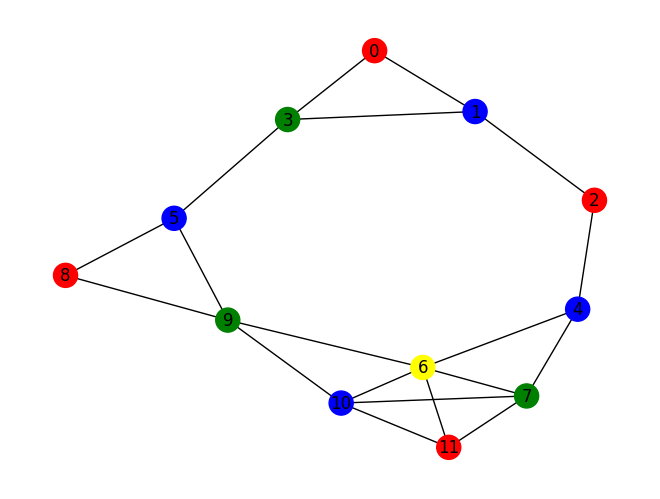

# YQuantum-Minimising-Wildfire-Risks

*Optimizing wildfire insurance portfolios by solving the MIS on a quantum computer for the YQuantum 2025 Travelers/Capgemini/QuEra challenge.*

### Instructions
- Install dependencies via `python -m pip install -r requirements.txt`. Some dependencies, such as juliapkg, are not used.
- Classical solution in `mis_classical.ipynb`.
- Quantum solution in `mis_quantum.ipynb`.
- Data in `data/`.
- Raw sample results from Aquila (QuEra's neutral atom quantum computer) in `quantum_results/`.

### Capabilities
Both the classical and quantum solutions generate a set of geographically diverse portfolios by creating a graph of the portfolios, and iteratively calculating the MIS. The MIS is calculated, nodes in it are deleted, and this process is repeated until there are no nodes left in the graph. Input data from files is not fully supported. To run on quantum hardware, use [qBraid](https://www.qbraid.com/), or [AWS Braket](https://aws.amazon.com/braket/). Running on qBraid is preffered; the code may need to be modified to run on the latter. 

Mainly, the code will generate a list of portfolios and a graph coloring such as the one below.

## Inspiration

Problem: Insurers struggle with clustered wildfire risks, where neighboring high-risk properties can trigger cascading losses.
Idea: Use quantum-inspired graph coloring (via maximum independent sets) to form diversified insurance portfolios that separate correlated risks.

## What it does

Data Modeling: Treats each house as a node with geographic coordinates and a risk appetite score.
Portfolio Formation: Uses iterative independent sets to group properties so that adjacent houses aren’t insured together.
Risk Adjustment: Refines groups by reassigning nodes if local neighbor conditions (e.g., desired appetite level) are met.

## How we built it

Parameter Initialization and Lattice Setup

Quantum Hardware Capabilities:
The algorithm begins by querying the system’s capabilities (using `get_capabilities()`), which provides key Rydberg parameters such as the C₆ interaction coefficient and the maximum Rabi frequency (Ωₘₐₓ). These quantities are used to determine derived parameters like the blockade radius (R₆) and the final detuning (Δ_end).

Lattice Construction:
A square lattice is generated via Bloqade’s Square class using a defined lattice spacing (e.g., 5.0 units). We add realistic imperfections by applying a defect density—removing some sites—so that the initial state mimics a real-world distribution of houses.

Quantum Annealing Protocol Definition

Pulse Scheduling:
The algorithm defines piecewise linear pulse protocols for both the Rabi amplitude and the detuning. These pulses form an annealing schedule (with ramp-up, sweep, and ramp-down periods) to drive the quantum system through its energy landscape.

Underlying Idea:
By carefully choosing these parameters, the system is coaxed into favoring low-energy states that correspond to maximum independent sets (MIS). In our context, an independent set represents a group of houses that are well separated (i.e., not at risk of simultaneous wildfire exposure).

Quantum Execution and Measurement

Running the Program:
The defined pulse sequence is executed over many runs (here, 100) using the quantum simulator (or hardware) via `program.bloqade.python().run()`.

Post-Processing Measurements:
The output is a probabilistic bitstring (or report) where each bit indicates the state of a lattice site (with ‘0’ typically marking a selected site for the independent set). A helper function extracts the most probable bitstring, identifying which sites (by their indices) form the quantum-selected independent set.

Recursive Extraction of Portfolios (MIS)

Iterative Removal:
The routine `mis()` takes the current lattice and the corresponding global indices and runs the quantum protocol. Once a measurement identifies a set of sites to be “removed” (i.e., forming one independent set), these sites are mapped back to the overall list (global indices) and saved as one portfolio.

Recursion:
The lattice is then updated—removing the selected sites—and the algorithm is recursively applied to the remaining sites. This process repeats until no sites remain, yielding multiple disjoint portfolios (each portfolio is an independent set).

Integration with the Risk-Averse Graph

Diversification:
The quantum MIS extraction ensures that houses grouped together in a portfolio are spatially separated, which inherently reduces correlated wildfire risk.

Risk-Averse Adjustments:
In a fully integrated solution, additional risk metrics (such as an appetite score) can be overlaid. For example, after determining the independent sets, the algorithm could adjust group membership by preferentially reassigning nodes based on neighbor risk characteristics—ensuring that a risk-averse portfolio has properties with lower cumulative risk.

Decision Support:
The final output is a collection of portfolios—each defined by the global indices of houses that are not spatially adjacent. This information directly supports insurance decision-making by highlighting which houses are optimally diversified to reduce correlated risk.

Final Output and Application

The algorithm prints the portfolios (lists of global indices) representing the MIS-based groupings.

In practice, these portfolios are then mapped back to the property data, allowing underwriters to decide which groups to insure together, optimizing for both spatial diversification and risk appetite.

This hybrid approach bridges classical risk assessment (via graph theory) with quantum-inspired optimization techniques, setting the stage for further integration with real quantum hardware.

## Challenges we ran into

Data Modeling: Capturing real-world risk correlations and risk appetite in a simple graph model.
Algorithm Complexity: Balancing the iterative independent set extraction with dynamic neighbor-based adjustments.
Scalability: Preparing the system for larger datasets and eventual quantum integration.
Communication: Translating complex quantum-inspired methods into clear insights for stakeholders.

## Accomplishments that we're proud of

Rapid Prototyping: Built a functional, end-to-end solution within hackathon time limits. Started with a solution in Julia and converted into Python very carefully.
Innovative Integration: Merged classical graph theory with quantum-inspired optimization for insurance risk management.
Clear Visualization: Created dual visualizations that communicate both raw grouping and appetite-adjusted portfolios effectively.

## What we learned

Interdisciplinary Approach: Combining insurance, graph theory, and quantum concepts can lead to innovative solutions.
Practical Quantum Insights: Even classical prototypes can incorporate quantum principles, paving the way for future hybrid solutions.
Iterative Prototyping: Rapid feedback and iteration are key in refining both the technical model and its business communication.

## What's next for Wildfire Insurance Portfolio Optimization

Scaling: Integrate larger datasets with richer risk features, including historical wildfire data.
Quantum Integration: Transition from classical simulation to using real quantum processors (e.g., through Bloqade).
Interactive Tools: Develop user-friendly dashboards for underwriters to adjust portfolios and simulate outcomes.
Pilot Programs: Collaborate with insurers to deploy and validate the model in real-world environments.
